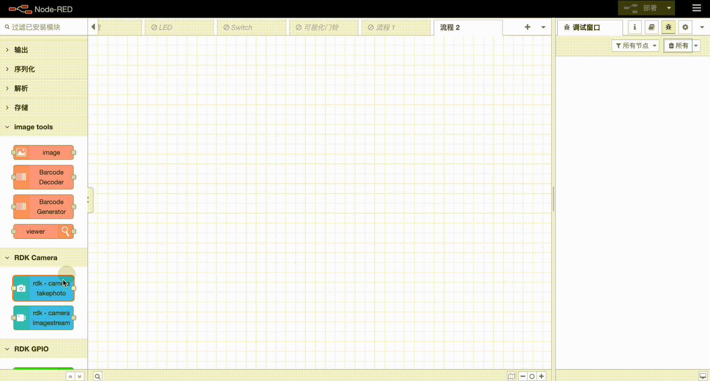

# node-red-node-rdk-camera
    在Node-RED中配合地平线RDK硬件使用的Camera相关功能的节点。
    RDK X3常与两种接口类型的摄像头结合使用。第一种是最常用的USB摄像头，第二种是MIPI摄像头。RDK Camera库也支持这两种接口类型的摄像头。


## 安装
可以在Node-RED编辑器中的节点管理面板中进行安装。也可以进入node-red安装目录进行手动安装：
```
    cd ~/.node-red
    npm i node-red-node-rdk-camera
```
## 使用
建议配合image-tools节点使用 [链接](https://flows.nodered.org/node/node-red-contrib-image-tools)



### 拍照节点(rdk-camera takephoto)


更多使用细节请参考说明文档：待发布

### 图像流节点(rdk-camera imagestream)


更多使用细节请参考说明文档：待发布

## 注意
+ rdk-camera中的节点需要与地平线RDK相关硬件及系统配合使用。[链接](https://developer.horizon.cc/)
+ 目前rdk-camera中的节点在每个flow中不能同时使用，在启动一个camera节点时，要确保其他camera节点处于关闭状态。（可以给camera节点输入start/stop达到启动/关闭节点的效果）

