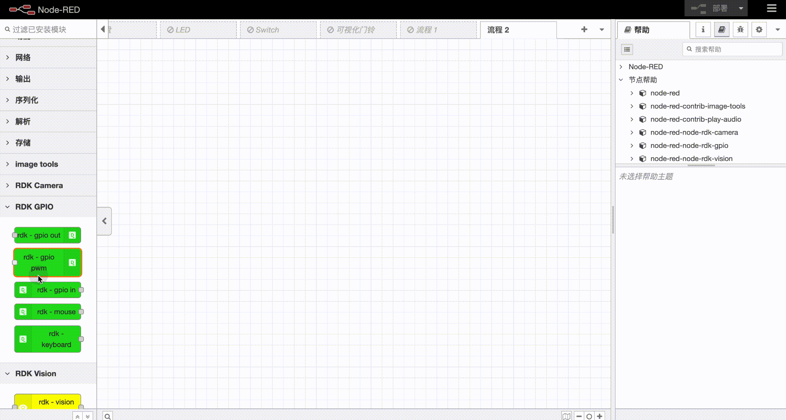

# node-red-node-rdk-gpio

## Install
There are two ways to install this module. The first one is using palette to manage module. The second one is installing manually using npm.
```
    cd ~/.node-red
    npm i node-red-node-rdk-gpio
```

## Usage


### rdk-gpio out


### rdk-gpio pwm


### rdk-gpio in


### rdk-mouse


### rdk-keyboard


## Notice
