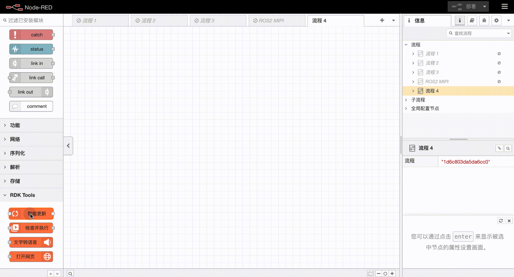
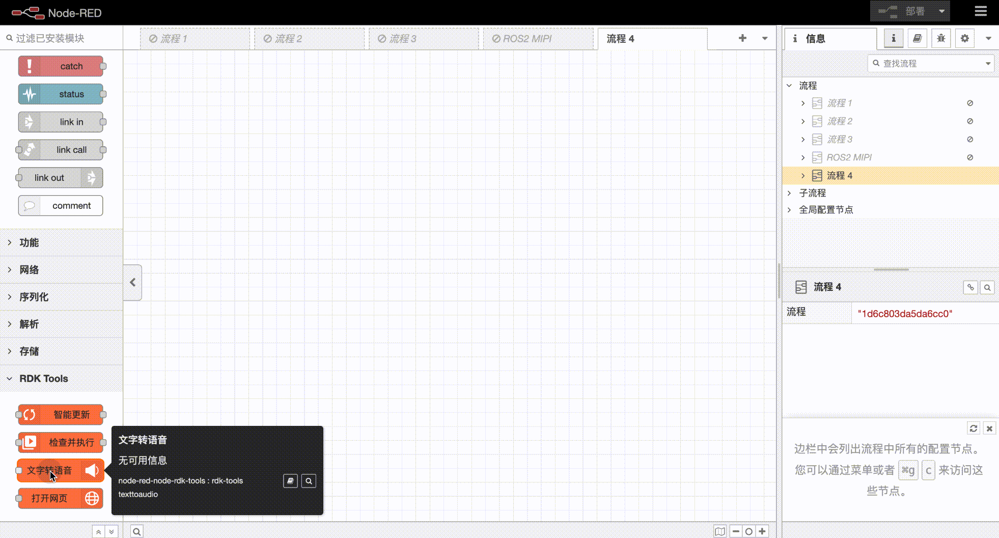

[English](./README.md) | 简体中文

# node-red-node-rdk-tools
在Node-RED中配合地平线RDK硬件使用的工具节点。

## 安装
可以在Node-RED编辑器中的节点管理面板中进行安装。也可以进入node-red安装目录进行手动安装：
```
    cd ~/.node-red
    npm i node-red-node-rdk-tools
```
## 使用
    
### rdk-tools smartupdate(智能更新节点)


### rdk-tools checkexecute(检测及执行节点)


### rdk-tools texttoaudio（文字转语音节点）


### rdk-tools openurl（打开网页节点）


## 注意
+ rdk-vision中的节点需要与地平线RDK相关硬件及系统配合使用。[链接](https://developer.horizon.cc/)