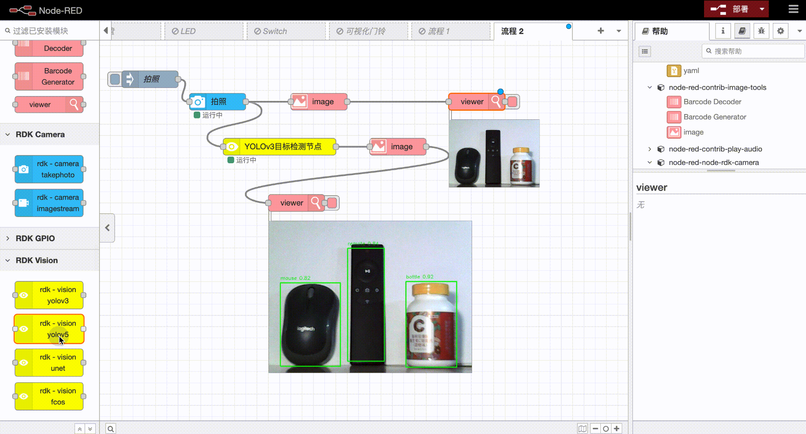
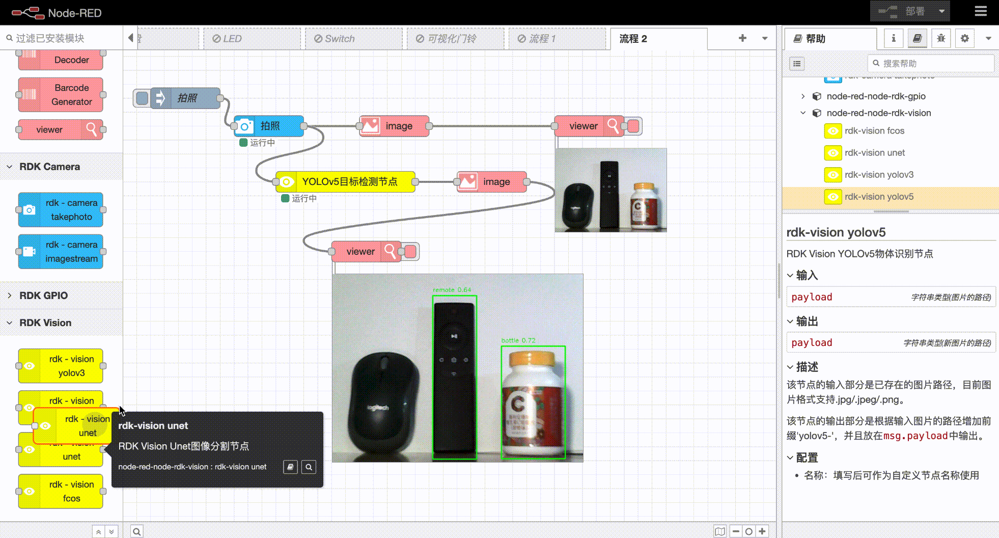

# node-red-node-rdk-vision（探索版）
在Node-RED中配合地平线RDK硬件使用的图像算法相关功能的节点。

## 安装
可以在Node-RED编辑器中的节点管理面板中进行安装。也可以进入node-red安装目录进行手动安装：
```
    cd ~/.node-red
    npm i node-red-node-rdk-vision
```
## 使用
    建议配合image-tools节点使用 [链接](https://flows.nodered.org/node/node-red-contrib-image-tools)
### rdk-vision yolov3节点


### rdk-vision yolov5节点


### rdk-vision unet节点


### rdk-vision fcos节点


## 注意
+ rdk-vision中的节点需要与地平线RDK相关硬件及系统配合使用。[链接](https://developer.horizon.cc/)